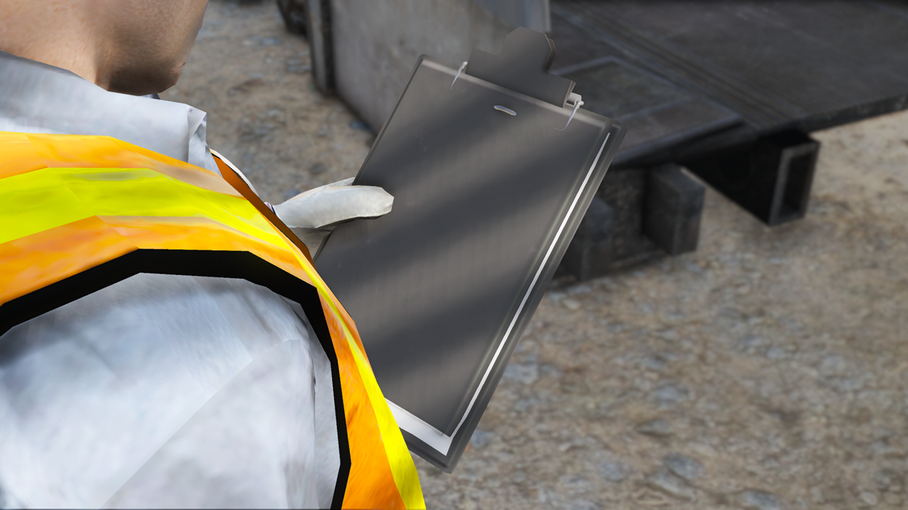
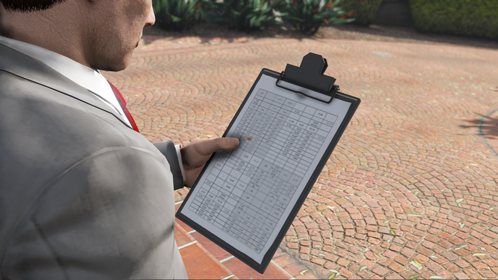
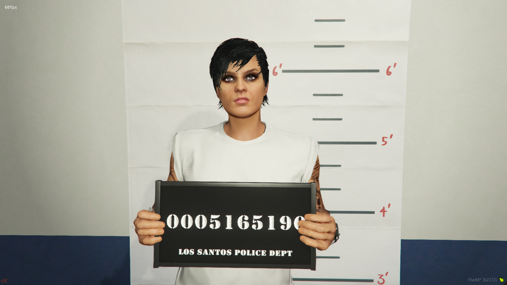
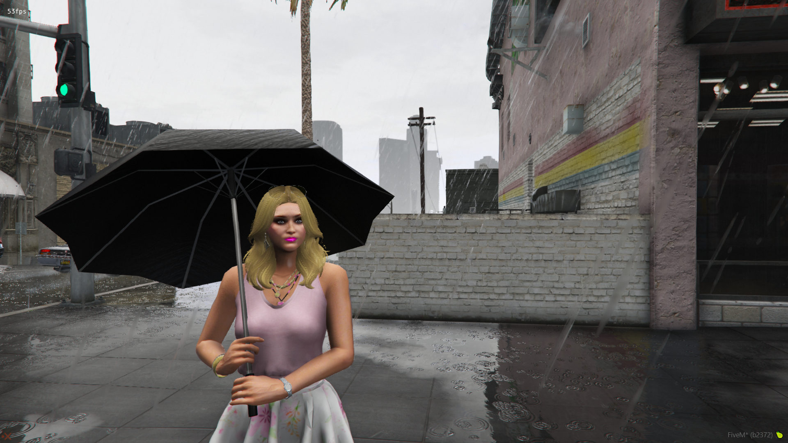

# addonsfordpemotes

Optional Add-Ons For DPEmotes https://github.com/TayMcKenzieNZ/dpemotes

Simply create a `stream` folder inside the DPEmotes folder and remove any additions you don't want.

# Content

- Fixes an issue with the clipboard and adds textures to paper (/e clipboard)
-  Adds textures to the mugshot prop (/e mugshot)
-  Changes umbrella to black (/e umbrella)
-  Retextured protest sign (can be changed using Texture Toolkit: https://www.gta5-mods.com/tools/texture-toolkit)

# Screenshots

| | | |
|-|-|-|
|  |  |  |
|  |  |
